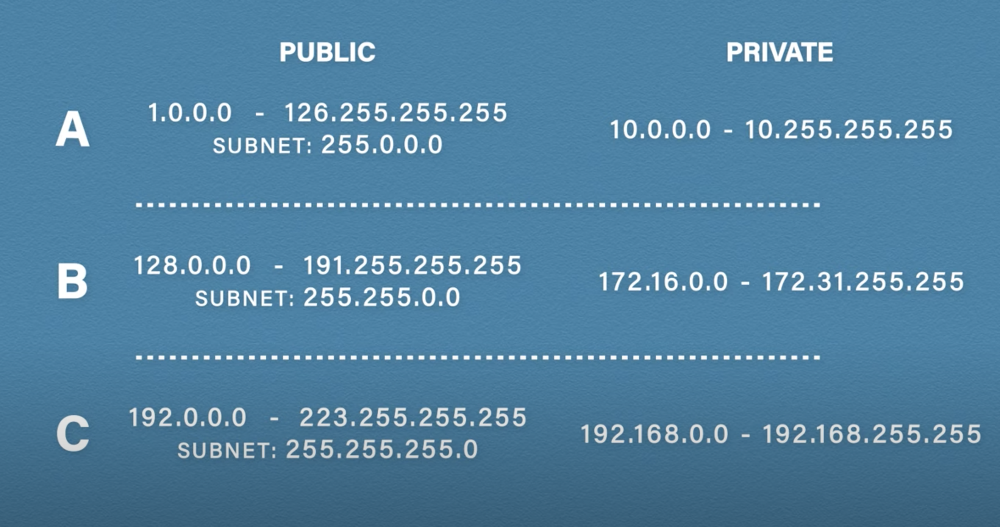
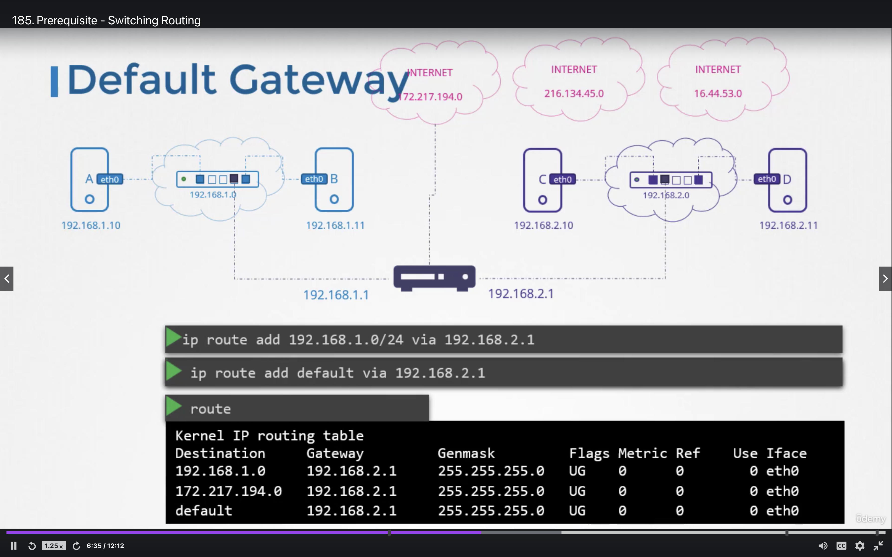

#Networking 

* `ip link` list interfaces for the host
* `ip addr add 192.168.1.10/24 dev eth0` to add ip-address to node
* Once this is done the nodes can communicate through the switch `ping 192.168.1.11`

* To check the existing route configuration on the system `route`
* To confiugre the system b on network '192.168.1.0 to reach system on network `192.168.2.0` bye the gateway `192.168.1.1` run the command `ip route add 192.168.2.0/24 via 192.168.1.1`
* By defualt linux doesn't forward packets from one interface to another. Whetehr a system can forward packets is governed by a setting `cat /proc/sys/net/ipv4/ip_forward` By default the value of the file is set to 0 set it to 1 and then the ping will go through. To make it presistent against reboot add `1` to `/etc/sysctl.conf` symilar for interface on systems `etc/network/interfaces`
* Setting alias for ip in this fiel    `/etc/hosts`
* DNS SERVER `cat /etc/resolv.conf`  `nameserver  192.168.1.100`

#### Network Namespace
* create namesapce `ip netns add red` to list `ip netns`
* To list the ip interface in networknamespace `ip netns exec red ip link`  or ` ip -n red link`
* connecting to network-namespaces `ip link add veth-red type veth peer name veth-blue` and the `ip link set veth-red netns red` and `ip link set veth-blue netns blue`
* Assing ip address to name-spaces
* `ip -n red addr add 192.168.15.1 dev veth-red` and  `ip -n blue addr add 192.168.15.2 dev veth-blue`
* Bring up the interfaces `ip -n red link set veth-red up` and `ip -n blue link set veth-blue up`
* ping between the namespace `ip netns exec red ping 192.168.5.1`

`ifconfig -a` to list the interfaces

`iptables -L -t nat | grep db-service`